# Wellness Buddy:
---
# Landing page
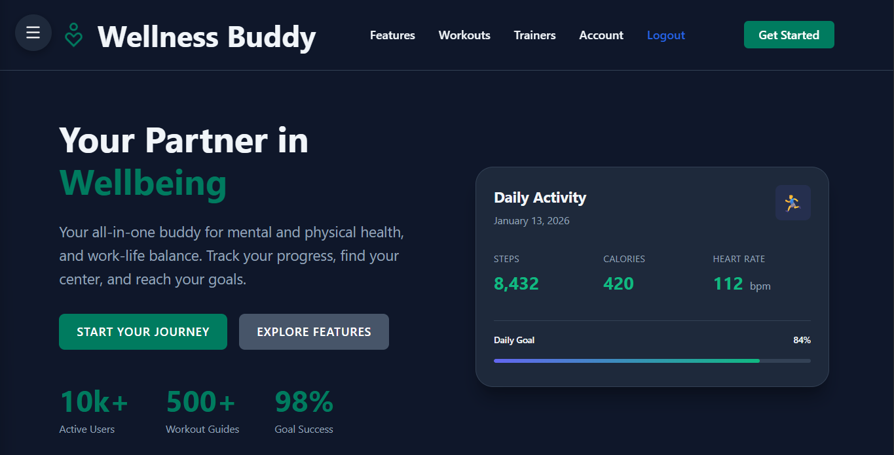
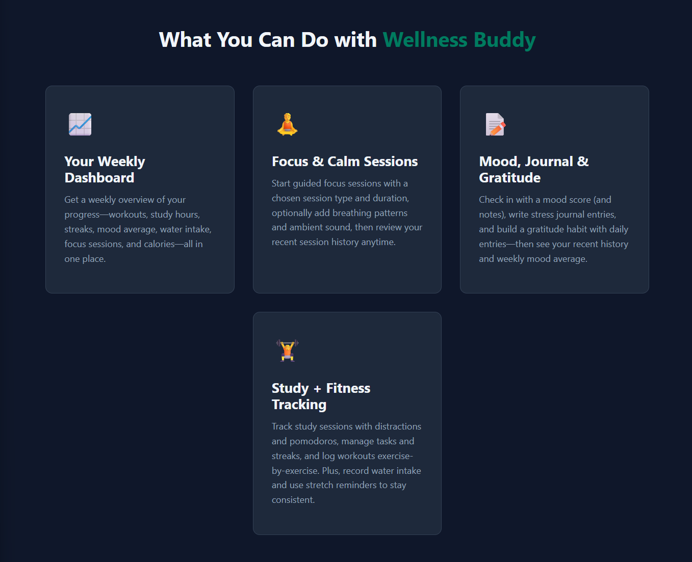
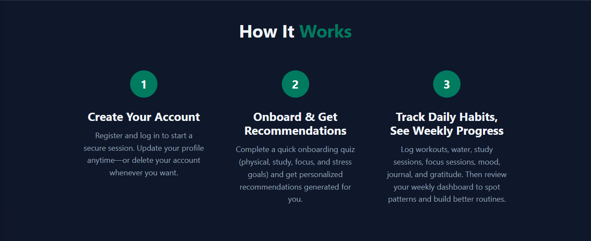
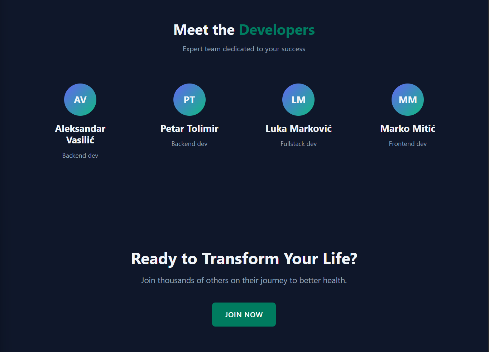
---
# Dashboard
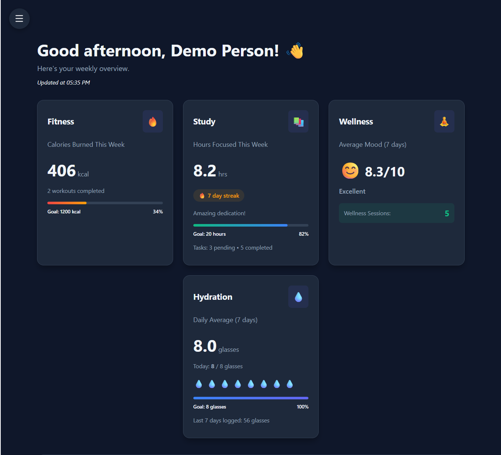
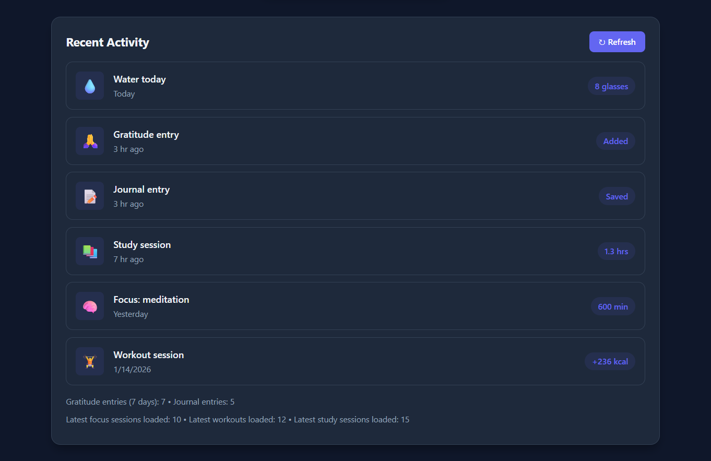
---
# Stress Management
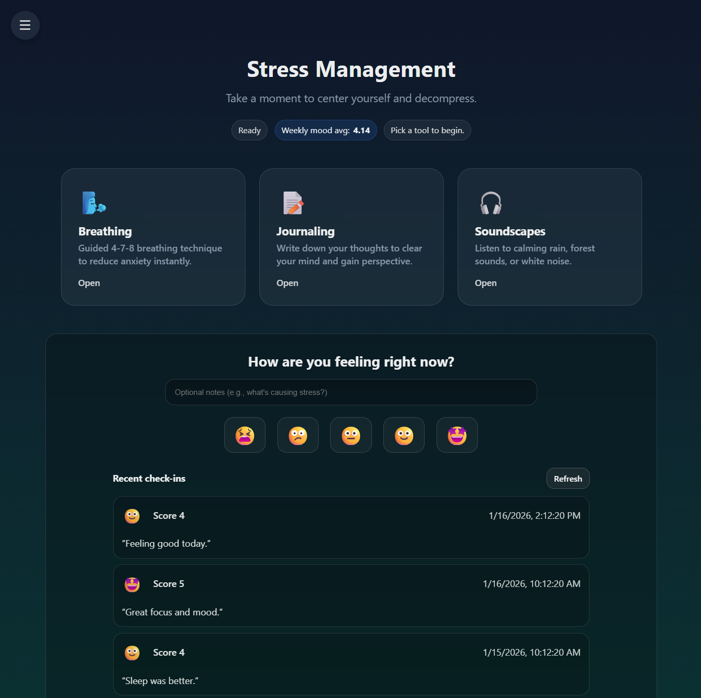
---
# Study
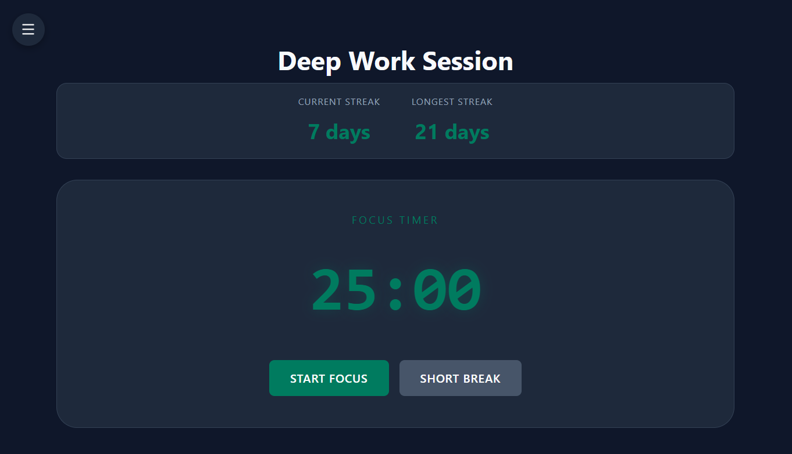
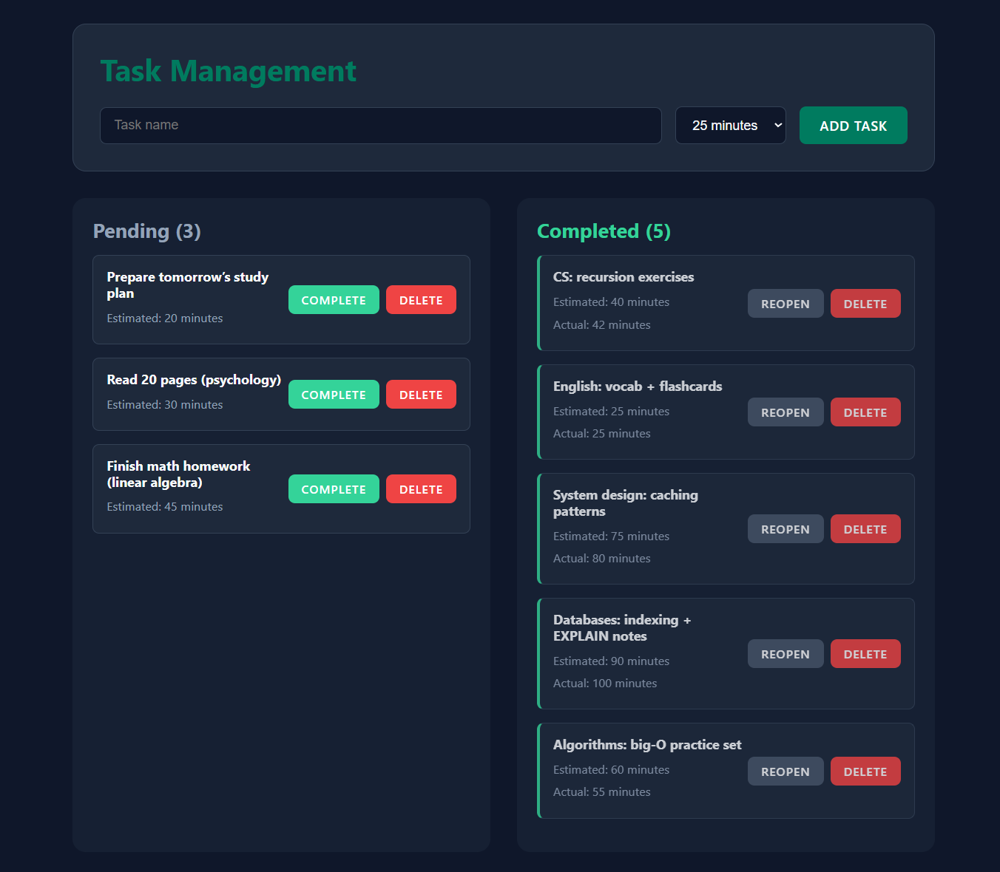
---
# Focus
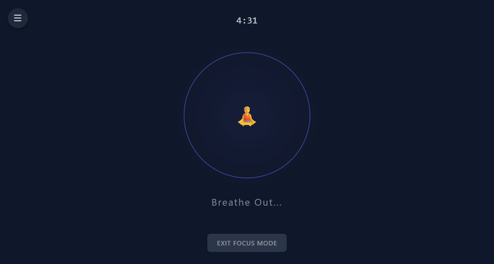
---
# Hydration
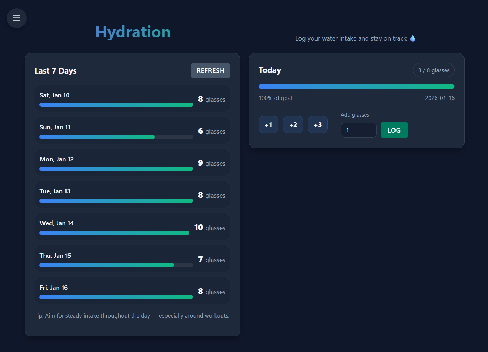
---
# Workout
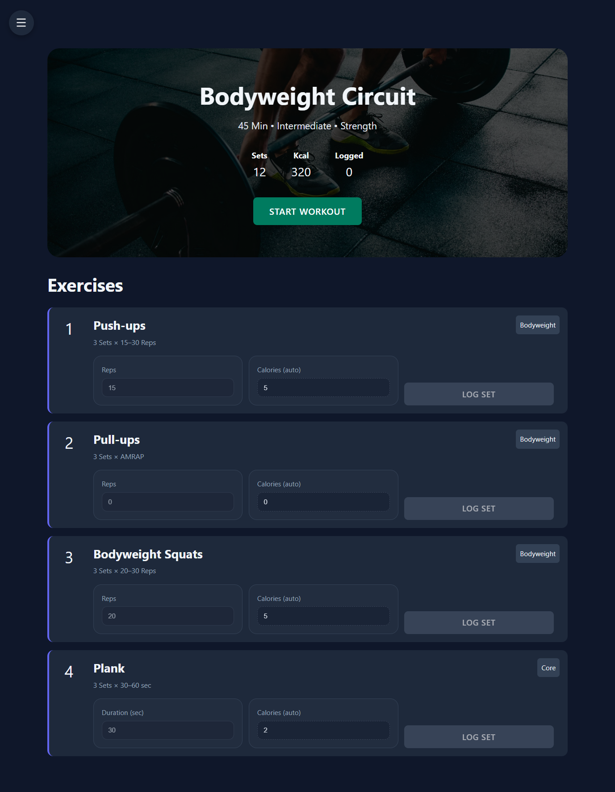
---
# Account
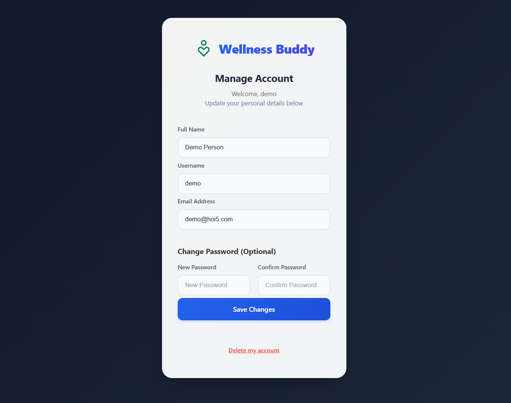
---

# Git repo za HZS
---
# Tech Stack:
1. Frontend - React + Typescript + Vite
2. Backend - Python Flask
3. Served over nginx

---
# Deployment
Deployed to https://react.hoi5.com \
API on https://hak.hoi5.com/api/health

# Build:
Current build script (build.sh) is designed to be ran on the linux server. Can be executed with 'sh ./domaci/src/build.sh'

# Requirements:
- [X] Minimum 3 pages
- [X] Make sure all pages are navigatable through UI
- [X] Databse with at least 2 tables
- [X] Have a github repo
- [ ] Switch repo to public
- [X] Have at least one form.
- [X] CRUD operations
- [X] Frontend data validation ( regex )
- [X] Use primarily grid and flexbox

# Bonus Requirements:
- [X] Host the website: https://react.hoi5.com
- [ ] Integrate a third party API
- [X] Authentication and authorization
- [X] Use cookies

# Final checklist:
- [ ] Demo video
- [ ] Go over all boilerplate text on site and make sure it uses the correct branding, etc.
- [ ] PDF documentation
- [ ] Exported mysql database
- [ ] Upload all of the above to a cloud storage and email to hzs@fonis.rs